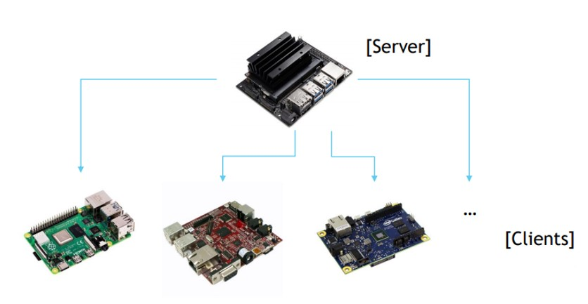
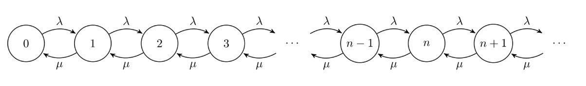

# IoT Project
This is a simulation of a Fog Computing Cluster of the topology depicted below. The cluster consists of a server with increased computing capabilities (Nvidia's Jetson Nano) and several other, resource-constrained client nodes. The clients can either choose to run their code locally or offload its execution to the server node. To facilitate this decision, the server node can provide an estimation of the mean waiting time at each point in time, depending on current workload. Furthermore, we assume that the clients have some prior knowledge of their applications latency and therefore can deduce which policy is the most beneficial. In the event that the execution was offloaded but takes longer than initially expected to complete, the client can choose to abort the offloaded execution and run locally.

During testing, the following microcomputers were utilized:
- Nvidia Jetson Nano (Server)
- Raspberry Pi 3     (Client)
- Raspberry Pi 4     (Client)
- BeagleBoard-xM     (Client)

# Dependencies
- gcc       (any version)
- ipaddress (any version)
- twisted   >= 14.0.0
- six       >= 1.10.0

# Queueing Model
The server receives requests that arrive at random times and independently from one another (Poisson Point Process), while the time required for servicing each request is also random and independent from every other request. Therefore, the system can be modeled as an M/M/1 queue, where the server receives requests with an exponential delay of mean value equal to 1/λ, and exponential execution latency of mean value 1/μ:

In equilibrium, the following equations apply:

where p_n is the probability of n clients residing in the queue.

From the first equation, we obtain:

where ρ = λ/μ.
By substituting n = 1 at the second equation, we obtain:

And eventually, if we continue substituting with 2, 3, .., n:

From the third equation though:

And thus, the probability of n clients residing in the queue is:

We can now compute the mean number of clients in the queue:

Using Little's Law, we can deduce the average time a client spends in the queue:

